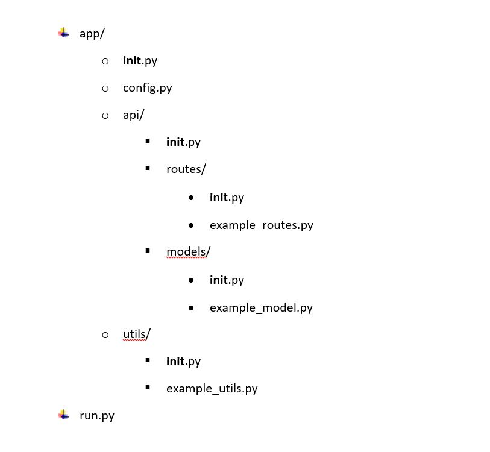

# Proyecto Programacion I: Servidor Backend 

## Estructura General

Esta estructura de archivos y carpetas es común en una aplicación Flask. Cada archivo y carpeta tiene una función específica para organizar y modularizar el código de la aplicación. Los diferentes submódulos, como api, routes, models y utils, ayudan a separar las responsabilidades y facilitan la expansión y el mantenimiento del código a largo plazo.

Antes que nada, la estructura cuenta con gran cantidad de archivos __init__.py, por lo que es necesario dar una breve explicación de ellos. Los __init__.py, en Python, se utilizan para indicar que un directorio es un paquete, realizar la inicialización y configuración del paquete, y controlar qué elementos son visibles desde el paquete. Son parte integral de la estructura de los paquetes en Python y juegan un papel importante en la modularidad y organización del código.

- app/
  - __init__.py: Este archivo es el punto de entrada para el paquete `app`. Se utiliza para inicializar y configurar la aplicación Flask.
  - api/
    - __init__.py: Este archivo es el punto de entrada para el módulo `api`. Se utiliza para inicializar y configurar el módulo `api` de la aplicación.
    - routes/
        - __init__.py: Este archivo es el punto de entrada para el submódulo `routes`. Se utiliza para inicializar y configurar las rutas de la API.
        - example_routes.py: Las rutas (también conocidas como endpoints) son las URL (Uniform Resource Locator) que se utilizan para acceder a diferentes recursos o funcionalidades proporcionadas por la API. Las rutas definen la estructura y la forma en que los clientes de la API pueden interactuar con ella.
    - models/
        - __init__.py: Este archivo es el punto de entrada para el submódulo `models`. Se utiliza para inicializar y configurar los modelos de datos de la API.
        - example_model.py: Los modelos definen la estructura y las propiedades de los datos, así como las relaciones entre ellos. Cada modelo representa una entidad específica y puede contener atributos que representan las columnas o campos de la entidad. Además, los modelos pueden incluir métodos y funciones que proporcionan lógica relacionada con la manipulación de los datos.
    - resources/
        - __init__.py: Este archivo es el punto de entrada para el submódulo `resources`. Se utiliza para inicializar y configurar los recursos de datos de la API.
        - example_serializer.py: Los resources son elementos clave en la arquitectura REST (Representational State Transfer) y se alinean con los conceptos de URI (Uniform Resource Identifier) y CRUD (Create, Read, Update, Delete). Cada resource de la API generalmente se asocia con una o más rutas y se puede realizar una variedad de operaciones en ellos, como obtener, crear, actualizar o eliminar, de esta forma representan los datos y las funcionalidades que se exponen a través de las rutas y los endpoints de la API.
  - utils/
    - __init__.py: Este archivo es el punto de entrada para el módulo `utils`. Se utiliza para inicializar y configurar las utilidades o funciones auxiliares de la aplicación.
    - example_utils.py: Las utilidades son funciones, clases o módulos que proporcionan funcionalidades genéricas o comunes que no están directamente relacionadas con la lógica de negocio principal de la API, pero que son útiles para realizar tareas auxiliares, manipular datos, realizar cálculos, formatear respuestas, realizar validaciones, y más. Al colocar estas utilidades en un directorio "utils", se puede tener un lugar centralizado para almacenar y organizar estas funciones, lo que facilita su reutilización y mantenimiento en diferentes partes del código de la API.
- run.py: Este archivo se utiliza para ejecutar la aplicación Flask y arrancar el servidor.
- config.py: Este archivo contiene la configuración de la aplicación, como las variables de entorno, la configuración de la base de datos y otras opciones.

## Instalación

Pasos para la instalación del proyecto. Por ejemplo:

1. Clona el repositorio: `git clone https://github.com/florenciaF/proyectoUM2023`
2. Accede al directorio del proyecto: `cd proyectoUM2023`
3. Instala las dependencias: `pip install -r requirements.txt`

## Uso

Pasos para ejecutar y utilizar el proyecto:

1. Abre una terminal en la carpeta del proyecto.
2. Crea un entorno virtual utilizando `python -m venv venv`
3. Activa el entorno virtual utilizando `cd venv` - `cd Scripts` - `activate.bat`, y vuelve a la raiz del proyecto.
1. Ejecuta el archivo `run.py`: `python run.py`
2. Accede a la API en `http://localhost:5000/`